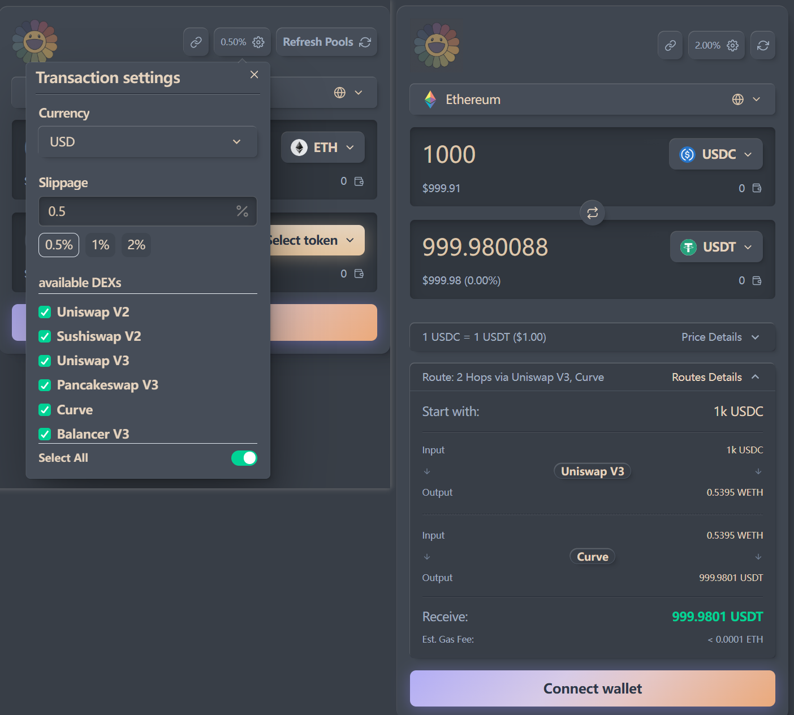
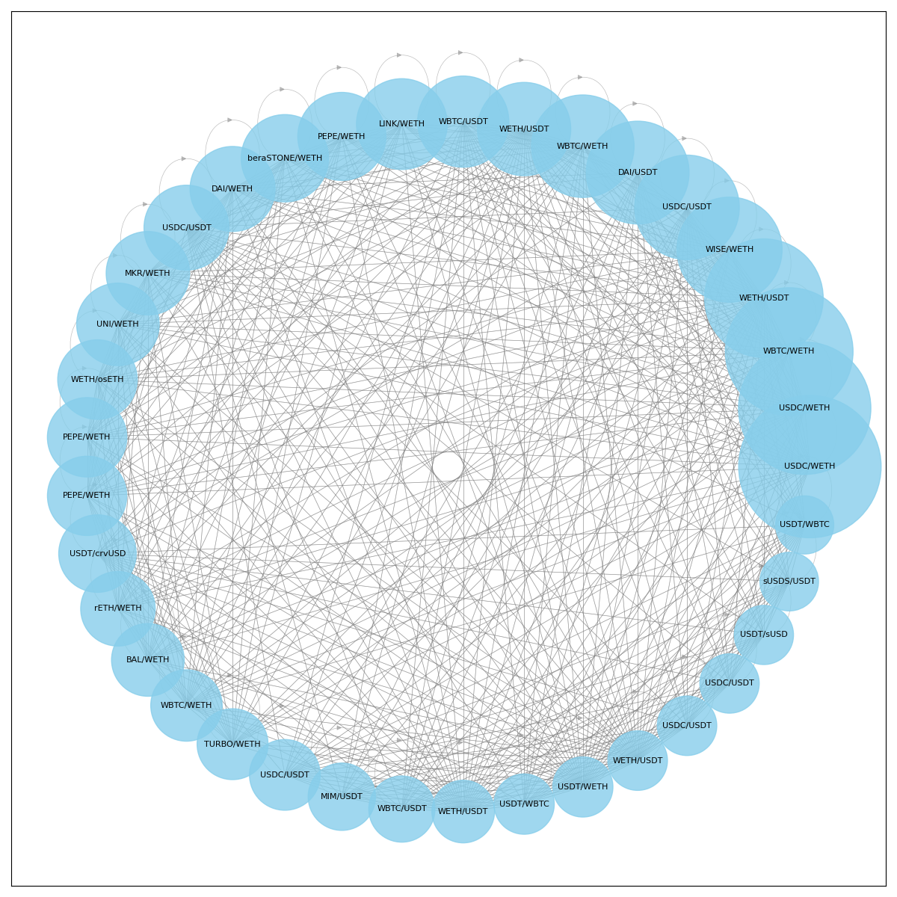

# DEX Aggregator Etanix




## 1. Introduction

DEX Aggregator Etanix designed to find the most optimal trading routes across various decentralized exchanges to provide users with the best possible swap rates. It consists of a backend for core logic, a frontend for user interaction, and smart contracts for on-chain operations or testing.

The DEXs available are as follows:
uniswap V2, uniswap v3, Sushiswap V2, Pancakeswap V3, Curve V1, Curve V2, Balancer V3

## 2. Project Structure

The project is organized into a monorepo structure with the following main components:

-   `backend/`: Contains the Python Flask application responsible for fetching on-chain data, calculating optimal swap routes, estimating gas fees, and providing an API.
-   `frontend/`: Contains the Next.js web application that serves as the user interface, allowing users to connect wallets, input swap details, and execute trades.
-   `testContract/`: Contains Solidity smart contracts developed using the Foundry framework, likely including core logic contracts, interfaces, and test suites.

## 3. Backend

The backend is the core engine of the Etanix.

### 3.1 Functionality

-   **Pool Data Collection (`pool_collector.py`):** Fetches liquidity pool data from various DEXs.
-   **Graph Construction (`graph_constructor.py`):** Builds a graph representation of available liquidity pools and tokens.
-   **Pathfinding (`path_crawler.py`, `pathfinder.py`):** Implements algorithms to find potential trading routes through the graph.
-   **Smart Order Routing (`smart_order_router.py`):** Analyzes potential routes to determine the most optimal path based on price, gas fees, and price impact.
-   **Simulate Swap (`simulateSwap.py`):** Calculates the expected price impact for a given trade size on a specific route, it's the entrance of the price impact calculation.
-   **Gas Fee Estimation (`gas_fee_estimator.py`):** Estimates the transaction cost (gas fee) for executing the swap.
-   **API Server (`server.py`):** Exposes endpoints (likely using Flask) for the frontend to request swap quotes and potentially other data. Includes Swagger UI (`flask_swagger_ui`) for API documentation.

### 3.2 Technology Stack

-   Python
-   Flask (with Async support)
-   Aiohttp
-   Web3.py
-   NetworkX
-   Gunicorn (for deployment)

### 3.3 Setup and Running

1.  **Navigate to the backend directory:**
    ```bash
    cd backend
    ```
2.  **Create and activate a virtual environment (recommended):**
    ```bash
    python -m venv venv
    source venv/bin/activate # On Windows use `venv\Scripts\activate`
    ```
3.  **Install dependencies:**
    ```bash
    pip install -r requirements.txt
    ```
4.  **Environment Variables:** Create a `.env` file in the `backend` directory based on a potential `.env.example` (if provided) or configure necessary variables like RPC endpoints, API keys, etc.
5.  **Run the development server:**
    ```bash
    flask run
    # Or using gunicorn for a more production-like environment
    # gunicorn --bind 0.0.0.0:5000 server:app # Adjust server:app based on server.py structure
    ```
6.  **API Documentation:** Access the Swagger UI endpoint (usually `/api/docs` or similar, check `server.py`) to explore the API.

## 4. Frontend

The frontend provides the user interface for interacting with the Etanix.

### 4.1 Functionality

-   Connects to user's Web3 wallet (e.g., MetaMask).
-   Allows users to select input/output tokens and amounts for swapping.
-   Displays optimal swap routes and quotes fetched from the backend API.
-   Facilitates transaction execution through the user's wallet.

### 4.2 Technology Stack

-   Next.js
-   React
-   TypeScript
-   Chakra UI
-   Wagmi / Viem / RainbowKit (Wallet interaction)
-   React Query (Data fetching/state management)

### 4.3 Setup and Running

1.  **Navigate to the frontend directory:**
    ```bash
    cd frontend
    ```
2.  **Install dependencies:**
    ```bash
    # Using pnpm as indicated by pnpm-lock.yaml
    pnpm install
    ```
3.  **Environment Variables:** Create a `.env.local` file in the `frontend` directory and configure necessary variables, such as the backend API URL (e.g., `NEXT_PUBLIC_API_URL=http://localhost:5000`).
4.  **Run the development server:**
    ```bash
    pnpm dev
    ```
5.  Access the application at `http://localhost:3000` (or the port specified).

*Note: Refer to `frontend/README.md` for potentially more detailed instructions.*

## 5. TestContract

This directory contains the Solidity smart contracts managed by the Foundry framework.

### 5.1 Functionality

-   May contain core logic related to swap execution or routing deployed on-chain.
-   Includes interfaces for interacting with DEX protocols (e.g., Uniswap V3).
-   Contains unit and integration tests for the smart contracts.

### 5.2 Technology Stack

-   Solidity
-   Foundry

### 5.3 Setup and Testing

1.  **Navigate to the testContract directory:**
    ```bash
    cd testContract
    ```
2.  **Install Foundry:** Follow the official Foundry installation guide if not already installed.
3.  **Install dependencies (libraries):**
    ```bash
    forge install
    ```
4.  **Compile contracts:**
    ```bash
    forge build
    ```
5.  **Run tests:**
    ```bash
    forge test
    ```

*Note: Refer to `testContract/README.md` for potentially more detailed instructions and deployment scripts.*

## 6. Overall Project Setup

To run the entire project:

1.  Set up and run the backend server.
2.  Set up and run the frontend development server.
3.  Ensure the frontend is configured to communicate with the backend API endpoint.
4.  (Optional) Deploy and configure necessary smart contracts from `testContract` if they are part of the core runtime logic.
